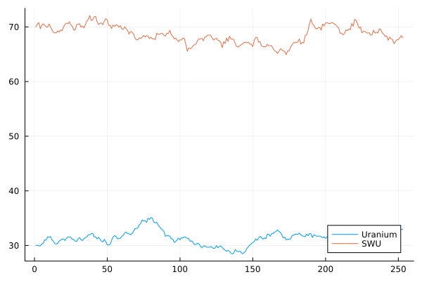
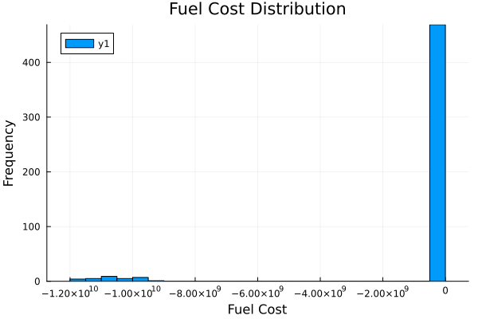
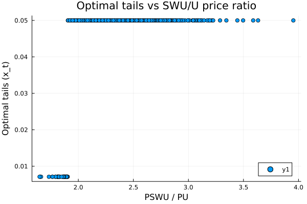

# Stochastic Modeling of the Nuclear Fuel Cycle Market Under SWU Price Volatility

This repository implements a Julia-based stochastic simulation and optimization framework to study how uranium prices, SWU prices, and enrichment decisions (tails assay) interact to determine optimal fuel procurement strategies.

Contents
- `src/price_models.jl`: OU price models and correlated simulation utilities.
- `src/enrichment_model.jl`: Enrichment balance equations, `V(x)` value function, SWU requirement, and fuel cost.
- `src/optimization.jl`: Optimal tails-assay solver using `Optim.jl`.
- `src/simulation.jl`: Monte Carlo driver producing cost distributions and optimal strategies.
- `plots/results.jl`: Plotting helpers for price paths, histograms, and sensitivity surfaces.
- `main.jl`: Example runner showing how to run a Monte Carlo experiment and save plots.
- `data/historical_prices.csv`: (placeholder) historical price data.

Mathematical summary

- Uranium price OU process:

  $$dP_U = \kappa_U(\theta_U - P_U)\,dt + \sigma_U\,dW_t$$

- SWU price OU process:

  $$dP_{SWU} = \kappa_{SWU}(\theta_{SWU} - P_{SWU})\,dt + \sigma_{SWU}\,dW_t$$

- Enrichment balance and isotopic equations:

  Fuel mass: $F = P + T$  
  Isotope balance: $F x_f = P x_p + T x_t$  

- SWU value function used in SWU requirement:

  $$V(x) = (1 - 2x) \ln\left(\frac{1-x}{x}\right)$$

- SWU requirement (per mass):

  $$SWU = P\,V(x_p) + T\,V(x_t) - F\,V(x_f)$$

- Fuel cost:

  $$C = P_U F + P_{SWU} SWU$$

Usage

1. Install Julia and add required packages listed in `Project.toml`.
2. Run `julia --project=.` and start `main.jl`:

```bash
julia --project=. main.jl
```

Outputs: example plots saved to `plots/` and a `results.csv` with cost and optimal tails per simulation.

References (suggested)
- Gardiner, C. W. (2009). Stochastic Methods: A Handbook for the Natural and Social Sciences.
- Hull, J. (2018). Options, Futures and Other Derivatives.
- IAEA reports on uranium enrichment economics.
- Industry reports: Urenco, Orano, Rosatom annual reports.

For thesis-level write-up, see `README_extended.md` (to be added) with detailed derivations and figures.

## Example Results (generated)

Below are example outputs from a sample Monte Carlo run (see `main.jl` for reproduction):

- Price paths (uranium vs SWU):



- Fuel cost distribution (histogram):



- Optimal tails assay vs SWU/U price ratio:


